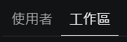

# Sample skills for .NET Framework

這是一套我自己在使用的 skill + rule + MCP tool + settings
，可編譯、執行 .NET Framework 專案，歡迎複製使用

後續可能會持續更新 skill 內容

## 安裝步驟

1. 如果你還沒有，安裝 [Microsoft VS Code <font size="1">~~微軟大戰程式碼~~</font>](https://code.visualstudio.com/)
1. MCP 工具建議使用 Docker 運行，如果你還沒有，安裝 [Docker/Docker Desktop](https://www.docker.com/)，然後就可以直接使用 [mcp.json](./.vscode/mcp.json)
    > 如果不使用 Docker ，請自行確保 [mcp.json](./.vscode/mcp.json) 中的 MCP 工具都可運行，可以參考 [各個 MCP 官方連結](#參考連結)
1. 參考 [建議設定](./docs/recommend-settings.md) 安裝套件、設定 VS Code
    如果 VS Code 設定打算只應用在工作區範圍，可以等下一步驟建立完成後，在 VS Code 左側功能列 > 齒輪圖標  > 設定 > 工作區 
    - 右上的開啟設定(JSON)  當中編輯 settings
    - 或是不開啟設定(JSON)，逐項在介面搜尋然後調整設定
1. 參考 [Git 建立步驟](./docs/git-repo-create-steps.md) 建立多 worktree 專案結構
1. [DBHub 設定](./.vscode.example/dbhub.toml)：把 `<DB_NAME>` 、 `<ACCOUNT>` 、 `<PASSWORD>` 、 `<DOMAIN>` 、 `<PORT>` 換掉
    - 注意 dsn 裡面的都要 url 編碼
    - 如果有多個資料庫可以直接複製整段貼上多個，像 `<DB_NAME_2>` 那樣
    - 如果只有單一資料庫，記得把 `<DB_NAME_2>` 那段刪掉
1. [skill 腳本所需設定](./.agents/skill-scripts.psd1)
    |設定項目|用途|是否必填|範例|
    |-|-|-|-|
    |BUILD_PROJECT_PATH|要建置的 csproj 相對路徑(相對於根目錄，不用`./`)|**必填**|`'XXXWeb/XXXWeb.csproj'`|
    |BUILD_MSBUILD_PATH|`MSBuild.exe` 絕對路徑|**必填**|`'C:/Program Files/Microsoft Visual Studio/2022/Community/MSBuild/Current/Bin/MSBuild.exe'`|
    |BUILD_FRONTEND_DIR_PATH|前端目錄路徑(相對於根目錄，不用`./`) 如果沒有則 build 時不會打包前端||`'XXXWeb/'`|
    |BUILD_NODE_VERSION|打包前端前確認的 node 版本||`'v24.14.0'`|
    |BUILD_FRONTEND_INSTALL_COMMAND|打包前端前 install 前端套件指令||`@('npm', 'install')`|
    |BUILD_FRONTEND_BUILD_COMMAND|打包前端指令||`@('npm', 'run', 'build')`|
    |RUN_IIS_EXPRESS_PATH|`iisexpress.exe` 絕對路徑|**必填**|`'C:/Program Files/IIS Express/iisexpress.exe'`|
    |RUN_IIS_APPLICATIONHOST_CONFIG_PATH|`applicationhost.config`相對路徑(相對於根目錄，不用`./`)(可以直接用 Visual Studio 產生的那份)|**必填**|`'.vs/XXX/config/applicationhost.config'`|
    |TEST_LOCAL_STASH_SHA|本機測試用 stash 的 SHA，如果沒有則測試時不會套用 stash||`'fakeshaabcdefghijklmnopqrstuvwxyz0123456'`|

## Skill 說明

### start-dev

使用 `/start-dev` 指令開始一個需求，跟 LLM 討論需求，叫他幫你產生需求目標檔案 `goal.md`，建立對應 git 分支。

### write-plan

使用 `/write-plan` 指令，會根據指定的 `goal.md`，規劃實作計畫、任務、測試計畫在 `specs/`

### implement-task

使用 `/implement-task` 指令，會根據指定的 `plan.md`，依序呼叫 subAgent 實作，並呼叫 subAgent 依據 `plan.md` 中定義的 AC 審查。

如果任務很多但其實可以並行實作，想要並行可以叫他並行實作各個任務，但建議要加上叫他讓不同 subAgent 使用不同終端機。

### testing-and-proof

如果是可以運行起來在瀏覽器驗證的功能或是 bug ，可以用這個 `/testing-and-proof` 指令叫他根據 `test-plan.md` 驗證。
這部分會先 apply 一份本機測試用 stash，然後再 build 、 run 、 test。(可以在 [skill-scripts.psd1](./.agents/skill-scripts.psd1) 裡面設定，如果留空就不 apply)

### build-project

使用 `/build-project` 指令或讓 LLM 自己觸發，使用已寫好的 ps1 腳本建置 .NET Framework 專案，如果有設定前端打包，也會打包前端。(可以在 [skill-scripts.psd1](./.agents/skill-scripts.psd1) 裡面設定)

### run-project

使用 `/run-project` 指令或讓 LLM 自己觸發，使用已寫好的 ps1 腳本運行 .NET Framework 專案在 IIS Express 上，需要先提供 applicationhost.config 檔案。(在 [skill-scripts.psd1](./.agents/skill-scripts.psd1) 裡面設定)

### commit-msg

使用 `/commit-msg` 指令，直接告訴 LLM 你要 commit 哪個 wroktree 的變更、哪些變更...之類的，然後它會給你適合的 commit 訊息

### db-management

定義了 db 相關的規則，通常不用手動使用，除非他看起來忘記 db 相關規則，可以標給他叫他依照 db 規則
- 分為 local 、 test 、 main
- read:
    - local 可以用 DBHub 直接讀取
    - test 、 main 會寫一段 sql 請使用者幫 LLM 查詢
- write:
    - 一律寫到 [sql files](./sql%20files/) 裡面，請使用者執行

### memory

定義了記憶相關的部分，通常不用手動使用
因為只有單純開 memory-server MCP 工具給 LLM 使用的話，它幾乎只在明確提到記憶相關字詞時才會使用，所以用這個 skill 讓它自主使用記憶

## 其他建議指南


## 專案結構

```text
...\my-project\
    my-project\           # Git repo, Git branch: main  + SVN repo: /my-project/main
    my-project.worktrees\
        dev-1\              # 純 Git 開發目錄，在裡面切換 feature/A、bugfix/some-bug、...
        dev-2\              # 純 Git 開發目錄，在裡面切換 feature/A、bugfix/some-bug、...
        ...
        test-1\             # Git branch: test/rc1  + SVN repo: /my-project/test/test1
        test-2\             # Git branch: test/rc2  + SVN repo: /my-project/test/test2
        ...
```

## 參考連結

- [Microsoft VS Code](https://code.visualstudio.com/)
- [Docker](https://www.docker.com/)
- [GitLens](https://www.gitkraken.com/gitlens)
- MCP 工具:
    - [DBHub](https://github.com/bytebase/dbhub)
    - [Knowledge Graph Memory Server](https://github.com/modelcontextprotocol/servers/tree/main/src/memory)
    - [MarkItDown-MCP](https://github.com/microsoft/markitdown/tree/main/packages/markitdown-mcp)

## Licence
MIT.