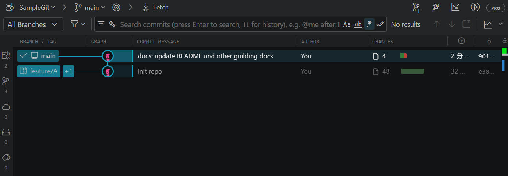
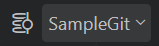
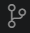
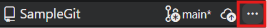
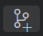

# GitLens 指南

GitLens 是一個綜合的 git 操作相關擴充功能，包含絕大多數常見的 git 操作都可以用 GitLens 以 GUI 的方式操作，告別終端機中的 git 指令。

## Commit Graph

Commit Graph 是 GitLens 的一個超好用的功能，同時可以視覺化瀏覽整個 git 的紀錄，還可以直接在 Commit Graph 執行常見 git 操作。

> Commit Graph 是 GitLens 的 Pro 功能，如果是有遠端的私人 repo ，需要訂閱 GitLens Pro 方案。
> 但遠端是 SVN 的話 GitLens 偵測不到，等於純本地 repo ，所以可以免費用，超讚。

    
概覽圖

    

### 切換 worktree
點擊  可以切換 worktree

### 切換 branch
雙擊  (或右鍵選擇 Switch Branch) 可以切換 branch
> 注意如果是當下已經位於別的 worktree 的 branch  ，不要雙擊，直接用切換 worktree 就好。

### 建立 worktree
Commit Graph 目前沒有發現好用的建立 worktree 方式，最方便的方式只有在 [建立 branch](#建立-branch) 最後改成選擇 Create Branch in New Worktree ，但是只能使用 GitLens 預設的路徑建立，其他選項有 bug 不知道為什麼按了沒用。

建議還是直接 VS Code 左側功能列 > 原始檔控制  > 存放庫 > main > `...`  > 工作樹 > 建立工作樹

### 建立 branch
1. 先切換到要分支出去的原分支、worktree，通常是 main
1. 點擊 
1. 選擇你要建立至哪個 worktree
1. 填寫 branch 名稱
1. 選 Create Branch

### Undo Commit
切換到要 Undo 的 branch，然後右鍵 HEAD Commit，選擇 **Undo Commit** 即可。

任意 branch 的 HEAD Commit 可以被 Undo，但只有當那個 Commit 後面沒有接其他東西時，那個 Commit 才會完全消失，不然會變成那個 branch 的 ref 往前一個 Commit 移動而已。

被 Undo 的 Commit 的那些變更不會消失，會被 pop 到 worktree 當中變成未提交的變更。

### 合併 branch
以下假設合併 `branch-A` into `branch-B`
1. 切換到目標分支 `branch-B`
1. 右鍵被合併分支 `branch-A`，選擇 **Merge Branch into Current Branch**
1. 然後選擇你要的合併模式
    - **Merge**: git 預設 Merge
        (只要可以 Fast-forward 就 Fast-forward ，否則 No Fast-forward Merge)
    - **Fast-forward Merge**: 當目標分支（`branch-B`）相對於被合併分支（`branch-A`）沒有產生新的提交時，Git 會直接將 `branch-B` 的指標移動到 `branch-A` 的最新提交，不產生額外的合併節點。
    - **Squash Merge**: 把被合併分支相對於目標分支的所有變更壓縮成一包變更，放到目標分支的 worktree 當中，不會自動 commit ，後續要再手動 commit。這種方法不會在兩個 branch 之間有合併節點。
    - **No Fast-forward Merge**: 在目標分支建立一個合併節點。如果有衝突會暫停變成 Don't Commit Merge
    - **Don't Commit Merge**: 把被合併分支相對於目標分支的所有變更放到目標分支的 worktree 當中，類似 Squash Merge，只是會處於合併中的狀態，所以提交之後，會建立合併節點，而不是一般節點。
        - 也可以用來處理衝突，處理完之後再繼續提交。
        - 也可以選擇 Abort ，取消這次合併， worktree 中的變更會被移除。
            

### 查看 Commit 資訊
雙擊 Commit 可以查看詳細內容，包含完整 Commit 訊息、變更...等等

## 比較 branch / commit / tag
GitLens: Search & Compare 視圖可以選擇兩個東西比較，可以是 branch 、節點 SHA 、 tag ...等等
或是在 Commit Graph 中右鍵 Commit 然後選擇 **Compare xxx**

## 其餘還有很多方便的功能，可以自行探索